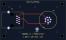
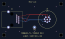
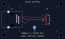

# RJ45 공통 지그용 커넥터 어댑터 PCB

설계 의도·이전 전용 지그와의 차이·검토 우선순위는 [설계 검토 인계](../DESIGN_REVIEW_HANDOFF.md)를 따른다. 아래 세 보드는 **수동 연결 어댑터**다. O/S/L/T 표준 PCB와 패널 도면, 제조 release까지 설계된 상태는 아니다.

**선택: 공통 balun 지그는 기존 RJ45 Rev B를 사용하고, 반복 측정용 어댑터는 PCB로 만든다.** 손배선에서 움직이는 untwist·납땜 부위의 형상을 고정할 수 있고, 커넥터 종류가 바뀌어도 balun PCB를 새로 만들 필요가 없다.

상태: **배선 완료, KiCad 10.0.6 DRC/ERC/회로도 대조 통과. 실물 mating·패널 기구·JLC 생산 CAM/coupon 승인 전 설계 초안. 공식 계산기 치수 반영은 완료했다.** 제조사 임피던스 시험이나 실측 RF 검증까지 완료했다는 뜻은 아니다.

## 구성과 제작 방식

`공통 SMA–balun–RJ45 PCB → 짧은 shielded RJ45 patch cable → 이 어댑터 PCB → DUT`

PCB용 RJ45 jack과 공장제 patch cable을 사용한다. 일반 RJ45 plug를 PCB 끝에 억지로 납땜하는 형태는 피하고, 측정 중 patch cable과 두 PCB를 고정한다. patch cable까지 어댑터 끝 보정에 포함한다. 일반 RJ45 DUT는 어댑터 없이 공통 지그에 연결한다.

| 어댑터 | DUT 쪽 PCB 커넥터 | 조립 판단 |
| --- | --- | --- |
| [m12_slipring](m12_slipring/m12_slipring.kicad_pro) | Finecables `MB12FBAFF08ST-3`, A-code 8핀 **암** | THT; 부품 조달 뒤 손납땜 가능한 구조. PG9 패널/브래킷으로 체결 토크 지지 |
| [m12_llc](m12_llc/m12_llc.kicad_pro) | Finecables `MB12MBAFF08ST-3`, A-code 8핀 **수** | THT; LLC 암 케이블용. 위 암 버전과 핀맵/성별이 다름 |
| [molex_slipring](molex_slipring/molex_slipring.kicad_pro) | Molex `5055680571`, 1.25 mm 5핀 SMT | 손납땜 가능성은 있으나 작은 SMT이므로 stencil/reflow 또는 JLC PCBA 권장 |

M12는 기존 저장소의 PCB 핀형 후보를 사용했다. 사내에 있는 **전선 인출형/납땜 컵형 M12 몸체를 그대로 이 풋프린트에 꽂을 수 있다는 의미가 아니다.** 실제 사내 부품을 재사용하려면 몸체 형식·핀 배열 도면에 맞춘 별도 carrier가 필요하다. 본 세 설계는 표에 적힌 PCB용 부품을 기준으로 한다.

Molex 케이블 housing은 기존 문서의 `5055650501` 후보와 실제 체결을 확인해야 한다. 같은 Molex 브랜드, 같은 핀 수만으로 호환되지 않는다. [제조사 제품 페이지](https://www.molex.com/en-us/products/part-detail/5055680571)의 mating cycle 정격도 고려해 시험용 커넥터의 교체/재체결 기록을 남긴다.

## 고정 핀맵

다음은 **저장소에 있던 사내 케이블 두 종류의 전용 배선**이다. 범용 M12 Ethernet 핀맵이 아니다. 임의 solder jumper 선택지를 넣지 않고 각 PCB 이름과 결선을 고정했다.

| RJ45 | 신호 | M12 슬립링 암 | M12 LLC 수 | Molex 슬립링 |
| --- | --- | ---: | ---: | ---: |
| 1 | A+ | 4 | 8 | 1 |
| 2 | A− | 3 | 2 | 2 |
| 3 | B+ | 2 | 3 | 3 |
| 6 | B− | 1 | 4 | 4 |
| 4, 5, 7, 8 | 미사용 | 연결 안 함 | 연결 안 함 | 연결 안 함 |

- 슬립링 M12 5–8, LLC M12 1/5/6/7, Molex 5는 PCB에서 각각 독립 NC다.
- LLC 전원 핀이나 슬립링 보조 신호/전원 핀을 GND 또는 shell에 연결하지 않는다.
- 핀맵 근거: [슬립링 PINMAP](../balun_slipring/PINMAP.md), [LLC fixture_spec](../balun_llc16/fixture_spec.json). 실제 DUT continuity 검증은 별도다.
- Open/Short/Load는 각 DUT 접속면에서 해당 **pair의 두 핀 사이**로 만든다. 이 어댑터 자체에 O/S/L 스위치를 넣지 않았다. 표준 정의는 [측정 계획](../VNA_TEST_PLAN.md)을 따른다.

## PCB 사양

| 항목 | 설계값 |
| --- | --- |
| 크기 / 홀 | 66 × 40 mm / 네 모서리 Ø3.2 mm NPTH, M3용 |
| stack-up | 4층 `JLC04161H-7628`, 주문 1.6 mm, nominal 1.5862 mm |
| 동박 | 외층 1 oz, 내층 0.5 oz |
| reference planes | L2/L3 SHIELD plane, stitch via 연결; 내층 신호 배선 없음 |
| pair A / pair B | M12 두 종류는 각각 F.Cu / B.Cu; Molex는 두 pair 모두 F.Cu |
| coupled trunk | 100 Ω 목표, W 0.234 mm / edge gap 0.216 mm |
| RJ45 pad escape | W 0.15 mm의 짧은 neckdown; 100 Ω trunk로 간주하지 않음 |
| signal via | 세 어댑터 모두 0개 |
| shield 접속 | RJ45 SH ↔ 내층 plane; TP1은 M12 두 종류에만 있고 Molex에는 DUT-side bond 없음 |
| M12 body | PCB 신호 핀에 shell 접속 없음; 패널/TP1 연결 여부를 별도 정의·기록 |

모든 부품 몸체는 F면이다. LLC M12는 부품 기준 180° 회전이며 도면/PCB의 A-key와 pin 1 표시를 따른다. M12 체결 토크를 신호 핀 납땜부에 맡기지 않는다. M3 head/washer는 OD 7 mm 이하의 기구 검토 범위이며, M12 panel 높이·nut 접근·실제 connector seating은 실물 도면으로 맞춘다.

| 어댑터 | A+ / A− 배선 길이 | B+ / B− 배선 길이 |
| --- | ---: | ---: |
| M12 슬립링 | 29.208 / 29.208 mm | 33.169 / 33.167 mm |
| M12 LLC | 36.659 / 36.659 mm | 28.514 / 28.514 mm |
| Molex 슬립링 | 30.738 / 29.349 mm | 31.798 / 30.046 mm |

M12 슬립링 B+는 폭 변경 후 clearance 확보를 위해 fanout을 0.05 mm 이동했고 P/N 길이 차이는 약 0.002 mm다. [계산·검증 상세](../docs/jlcpcb/IMPEDANCE.md)를 참고한다.

길이는 track 중심선 합계이며 커넥터 내부 핀 길이와 via 전기 길이를 포함하지 않는다. Molex는 큰 길이보정 우회로와 B-pair signal via를 제거하고 두 pair의 긴 결합 구간을 F.Cu에 배치했다. 그 결과 PCB track 길이 차이는 A 약 1.39 mm, B 약 1.75 mm이며, 큰 loop를 다시 추가하기보다 짧고 밀접한 배선을 우선한 의도적 절충이다. 최종 mode conversion이나 정확한 임피던스는 이 표만으로 보장하지 않는다.

**RF 재검토 우선 항목:** 특히 M12 LLC pair A의 넓은 fanout이 작은 skew를 허용한 더 짧고 밀접한 배선보다 유리한지 확인해야 한다. track 합계 길이 일치에 앞서 uncoupled 길이, loop 면적, 기준면에 대한 대칭을 함께 비교한다. 현재 형상의 우월성을 EM 해석이나 실측으로 검증하지 않았다.

## 레이아웃

빨강 F.Cu, 파랑 B.Cu. M12의 교차처럼 보이는 다른 색 선은 서로 다른 외층이며 사이에 두 reference plane이 있다. Molex의 두 pair는 모두 빨강 F.Cu다. `planes.svg`에서 채워진 내층 plane도 확인할 수 있다.

### M12 슬립링용 암



[회로도](m12_slipring/m12_slipring.kicad_sch) · [PCB](m12_slipring/m12_slipring.kicad_pcb) · [내층](m12_slipring/planes.svg)

### M12 LLC용 수



[회로도](m12_llc/m12_llc.kicad_sch) · [PCB](m12_llc/m12_llc.kicad_pcb) · [내층](m12_llc/planes.svg)

### Molex 슬립링용



[회로도](molex_slipring/molex_slipring.kicad_sch) · [PCB](molex_slipring/molex_slipring.kicad_pcb) · [내층](molex_slipring/planes.svg)

## 검증과 JLC 제작

- [기존 지그 검토](FIXTURE_REVIEW.md)
- [JLCPCB 제작 조건과 조립 BOM](JLCPCB_BUILD.md)
- [검증 결과와 CAD SHA-256](verification.json)
- [풋프린트 출처](FOOTPRINT_SOURCES.md)

```bash
# KiCad 10의 pcbnew가 설치된 Python으로 새 폴더에만 재생성
python adapters/generate_adapters.py /path/to/new-output
# 저장소의 세 보드 zone refill / DRC / ERC / parity / pinmap / SVG
python adapters/verify_adapters.py --kicad-cli /path/to/kicad-cli
```

generator는 이미 존재하는 출력 폴더를 덮어쓰지 않는다. `verify_adapters.py`는 zone fill을 보드에 저장한 뒤 검사와 hash를 기록한다. 검사 통과는 핀맵의 CAD 전사·배선 검증이며 제조사 mating 검증이나 양산 release 승인이 아니다.
