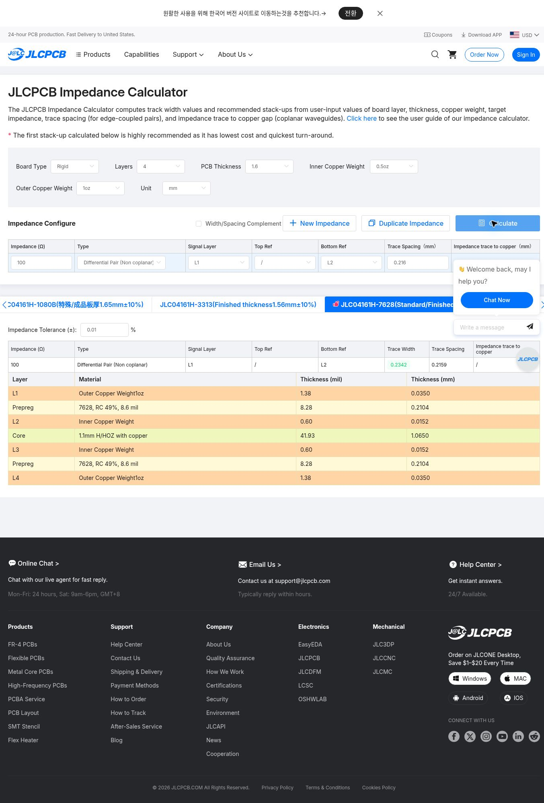
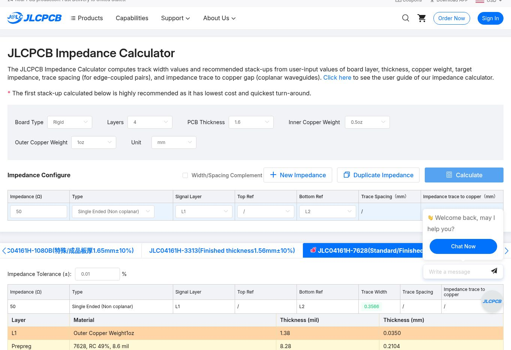

# JLC04161H-7628 임피던스 계산과 CAD 반영

확인일 **2026-09-05**. 대상은 공통 `balun_eth_rj45`와 현재 수동 어댑터 3종이다. **공식 계산기에서 목표 50Ω/100Ω에 필요한 폭을 구하고, native CAD·project·DRC rule·생성 스크립트에 반영했다.** 주문 방법은 [화면별 가이드](README.md)를 따른다.

## 확정한 설계 치수

| 용도 | 신호층 / 기준면 | 목표 | 공식 계산기 출력 | 현재 CAD |
| --- | --- | --- | --- | --- |
| 공통 지그 SMA 측 | L1 / L2 | 50Ω single-ended | W 0.3566 mm | **W 0.357 mm** |
| 외층 차동 trunk | L1 / L2 | 100Ω differential | W 0.2342 / gap 0.2159 mm | **W 0.234 / gap 0.216 mm** |
| 외층 차동 trunk | L4 / L3 | 100Ω differential | W 0.2342 / gap 0.2159 mm | **W 0.234 / gap 0.216 mm** |

간격은 **edge-to-edge**다. CAD 중심 간격은 0.450 mm로 유지했다. 기존 0.23/0.22 mm에서 폭을 4 µm 늘리고 gap을 4 µm 줄였다. 50Ω 폭은 0.35→0.357 mm다. CAD는 1 µm 단위로 반올림했다. 이는 계산 모델에 따른 목표 치수 확정이며, 제조된 PCB가 정확히 100.000Ω이라는 뜻은 아니다.

현재 JLC UI는 목표 임피던스와 gap에서 폭을 구하는 **역산 계산기**다. 이전 폭을 넣어 실제 Z를 측정한 것도, 반올림한 CAD의 forward EM 해석을 수행한 것도 아니다. 2026-08-31 기록의 과거 forward 결과는 이번 최신 결과로 재현되지 않았으므로 현 주문의 정량 근거로 재사용하지 않는다.

## 재현 입력

- Board Type Rigid, 4 layers, thickness 1.6 mm, inner 0.5 oz, outer 1 oz, mm.
- Width/Spacing Complement **OFF**.
- Type: Single Ended (Non coplanar) 또는 Differential Pair (Non coplanar).
- 차동 입력: 100Ω, Trace Spacing **0.216 mm**. L1/Bottom Ref L2와 L4/Top Ref L3 각각 실행.
- 단일 입력: 50Ω, L1/Bottom Ref L2.
- 결과에서 반드시 **JLC04161H-7628 (Standard/Finished thickness 1.59 mm±10%)** 탭 선택.
- 결과의 numerical Impedance Tolerance를 **0.01%**로 정한 후 재계산. 이는 solver 수렴 설정이지 제조 보증 공차가 아니다. 실제 주문 공차는 100Ω ±10%, 50Ω ±5Ω다.

처음 기본 numerical tolerance 0.5%에서 단일 폭 0.3586 mm가 나왔고, 0.01%로 재계산하면 0.3566 mm였다. 이전 gap 0.220 mm 조건에서는 차동 폭 0.2365 mm가 표시됐다. 최종 선택에는 위 표의 결과만 사용한다. 입력 gap 0.216이 결과에 0.2159로 보이는 것은 UI의 단위/표시 정밀도 차이며 별도의 실제 가공 측정값이 아니다.

[당시 렌더링 결과 텍스트와 입력](calculator-observations.json)에 초기 탐색과 최종 결과를 구분해 보존했다. 아래 캡처는 실제 페이지이며 별도로 그린 계산 결과가 아니다.





[L4 결과 텍스트](differential-l4.txt)에도 0.2342 / 0.2159 mm를 확인했다. L4 결과는 텍스트로 보존했으며 별도의 L4 이미지가 있는 것으로 표시하지 않는다.

## 계산 모델과 적층

JLC [계산기 안내](https://jlcpcb.com/help/article/user-guide-to-the-jlcpcb-impedance-calculator)는 4–8층에 NP-155F를 가정한다. outer prepreg는 0.2104 mm / Dk 4.4, solder mask 포함 non-coplanar microstrip이다. 안내의 mask 두께는 base/between 1.2 mil, trace 위 0.6 mil, mask Er 3.8이며 도체 상단 폭은 하단보다 0.7 mil 작게 모델링한다. 외층 완성 동박 모델 1.6 mil(0.04064 mm)과 적층표의 base Cu 0.035 mm를 혼동하지 않는다. CAD 적층에 완성 동박을 중복 가산하지 않았다.

| 위에서 아래 | CAD / 공식 적층표 두께 |
| --- | ---: |
| L1 Cu | 0.0350 mm |
| Prepreg 7628 | 0.2104 mm |
| L2 Cu | 0.0152 mm |
| Core dielectric | 1.0650 mm |
| L3 Cu | 0.0152 mm |
| Prepreg 7628 | 0.2104 mm |
| L4 Cu | 0.0350 mm |

합계 1.5862 mm, 주문 메뉴 1.6 mm다. CAD의 core Dk 4.36은 기존 입력으로 남겼고 공급사 확정값으로 인증하지 않았다. 이번 외층 모델의 인접 기준면까지 dielectric은 7628 prepreg이며 core가 그 사이에 들어가지 않는다. 정확한 생산 재료/압착 조건은 CAM과 coupon으로 확인한다.

## CAD 변경과 검사

- 네 프로젝트의 ETH100 netclass 폭/간격, 실제 trunk, 사용자 DRC rule 및 생성 스크립트를 함께 수정했다. 공통 RF50도 0.357 mm로 변경했다.
- 기존 0.15 mm RJ45 escape는 유지한다. pad/connector/balun fanout은 균일 100Ω 구간으로 표시하지 않는다.
- 폭 증가 후 M12 슬립링 pair B fanout에서 기존 0.20 mm clearance보다 작은 0.1983 mm 간격이 검출됐다. B+ trunk 끝 X를 **42.00→42.05 mm**로 연장해 해결했다. 규칙을 낮춰 통과시키지 않았다. 이로 인한 B+/B− 길이는 약 **33.169/33.167 mm**, skew 약 0.002 mm다.
- 기존 부품·핀맵·적층과 외형을 유지한다. 일반 trunk 중심선은 유지하며 위 국소 fanout 지점만 이동했다.
- 공통 지그: KiCad 10.0.6 zone refill 후 **DRC 0 / 미연결 0 / schematic parity 0**, [보고서](../../adapters/fixture_drc.json).
- 어댑터 3종: **DRC/ERC/parity 0**, 고정 pinmap/NC 검사 통과, [검사와 파일 SHA-256](../../adapters/verification.json).
- 별도 [geometry audit](geometry-audit.json): native 보드의 폭, 5 mm 이상 평행 결합 구간의 수직 중심 거리와 edge gap, 길이, pad 근접 비아를 확인했다. 사선 trunk의 저장 좌표 반올림으로 gap은 0.215999–0.216001 mm 범위다. 짧은 fanout을 이 검사로 인증하지 않는다.

재검사(읽기 전용, KiCad 10 pcbnew Python 필요):

```bash
python docs/jlcpcb/audit_geometry.py > /tmp/geometry-audit.json
```

공통 지그의 ERC는 이번 폭 변경 검증에서 재실행하지 않았다. 회로도 parity 및 DRC 결과와 구분한다. Python 보정 알고리즘은 이번 패치에서 바꾸지 않았다.

**남은 확인은 생산 CAM·coupon·부품 실물 및 RF 측정이다.** 이 계산과 DRC는 커넥터의 mode conversion, 손납땜부 기생성분, OSL 모델 오차를 보증하지 않는다. 일반 주문 두께 ±10%는 SMA의 1.60±0.05 mm 기구 요구보다 넓으므로 별도 제조 확인이 필요하다.
