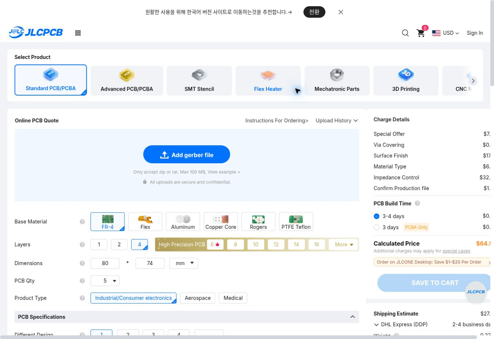
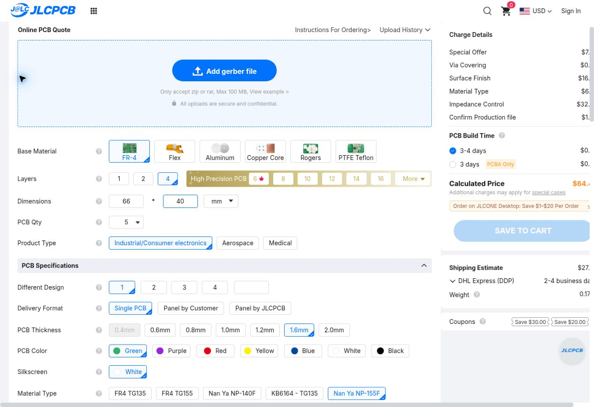
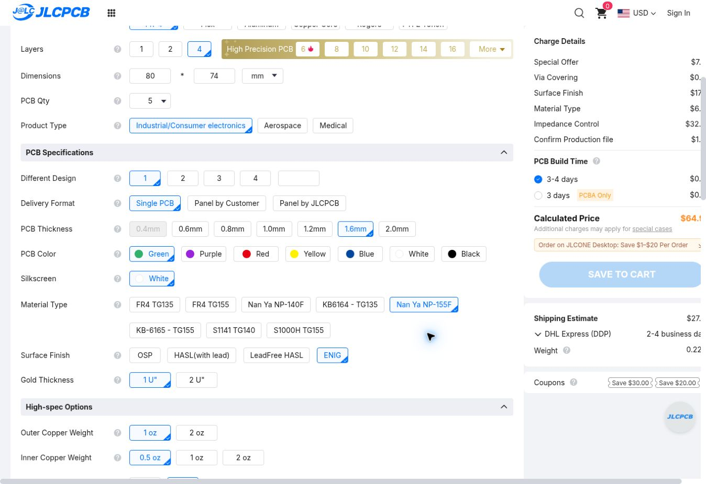
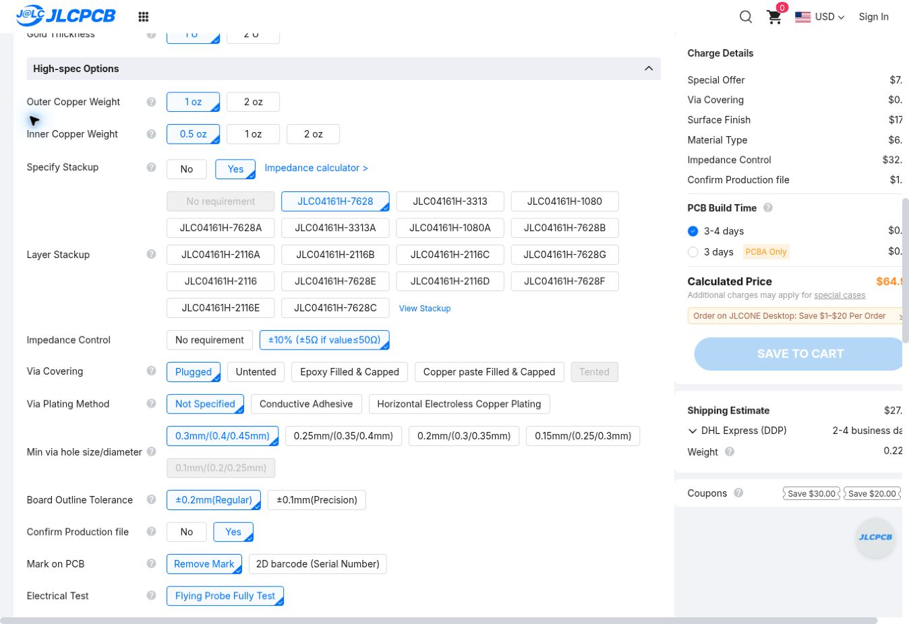
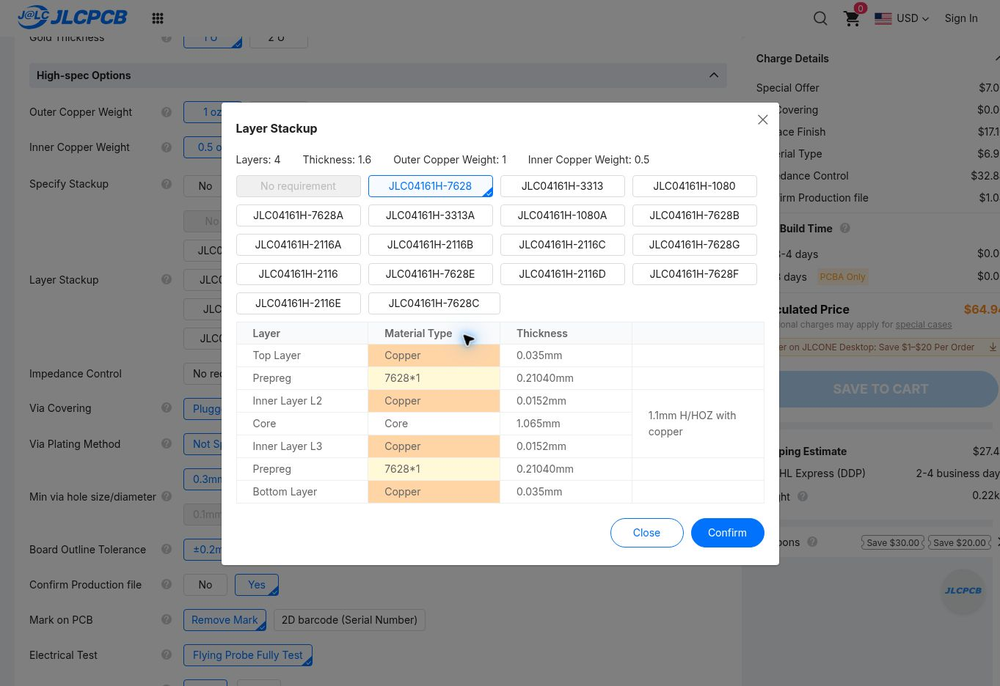
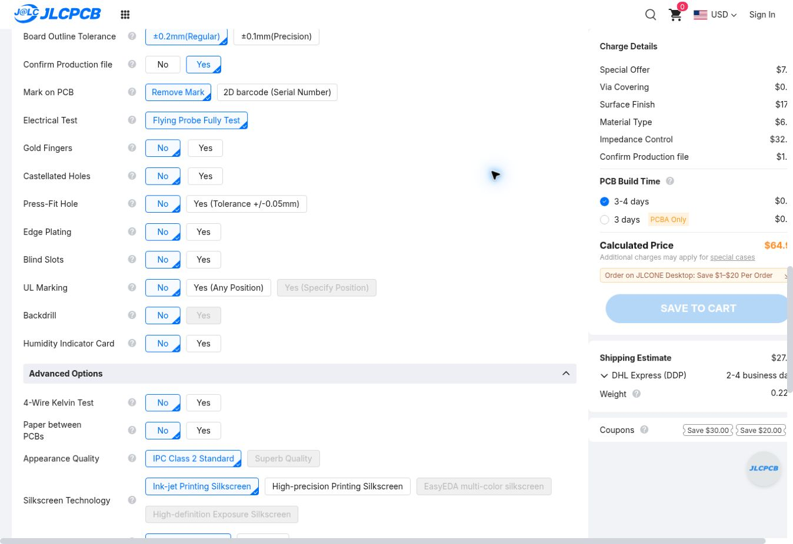
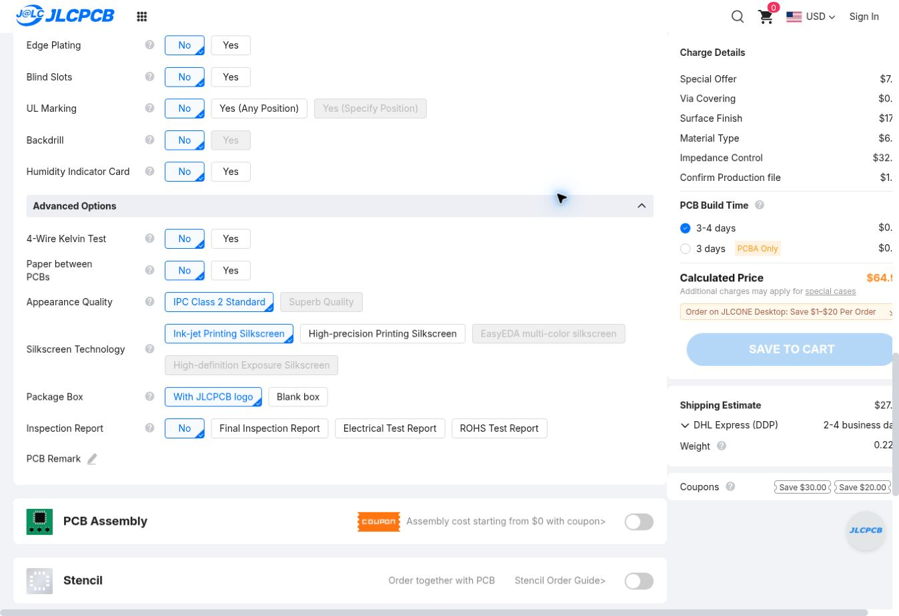

# JLCPCB 주문 옵션 — 현재 공통 지그와 수동 어댑터

확인일: **2026-09-05**. 이 문서는 현재 `balun_eth_rj45`와 `adapters/` 3종의 주문 설정 기준이다. 루트의 이전 구매 가이드보다 이 문서를 우선한다. **실제 JLC 주문 화면에서 옵션을 선택하고 캡처했다.** Gerber 업로드·CAM 승인·주문·결제는 하지 않았다. 이미지의 5장은 설정 확인용 예시이며 전체 구매 수량을 확정한 것이 아니다.

**결정: FR-4 / 4층 / 1.6 mm / Nan Ya NP-155F / 외층 1 oz·내층 0.5 oz / JLC04161H-7628 / Green / ENIG / 임피던스 제어 선택.** 배선도 [공식 계산 결과](IMPEDANCE.md)에 맞춰 수정했다. 균일 구간은 차동 W **0.234 mm**, edge gap **0.216 mm**, 공통 지그 SMA 측 W **0.357 mm**다.

## 1. 보드별로 따로 입력

| 프로젝트 | Dimensions | Different Design | Delivery Format | 필요한 실사용 수량의 기준 |
| --- | --- | --- | --- | --- |
| `balun_eth_rj45` | 80 × 74 mm | 1 | Single PCB | 양단 측정에 동일 보드 2장 |
| `adapters/m12_slipring` | 66 × 40 mm | 1 | Single PCB | 실제 양단 커넥터 구성에 맞춰 결정 |
| `adapters/m12_llc` | 66 × 40 mm | 1 | Single PCB | 위와 같음 |
| `adapters/molex_slipring` | 66 × 40 mm | 1 | Single PCB | 위와 같음 |

세 어댑터를 한 ZIP에 넣고 Different Design=1로 주문하지 않는다. 각 보드별 Gerber ZIP을 별도 품목으로 올린다. PCB Qty=5는 이번 화면의 시제품 예시다. 부품 실장 수량과 bare PCB 제조 수량을 구분한다. 기존 전용 balun 보드의 총수량을 합산하지 않는다.





## 2. 재료와 기본 제작 옵션

| 화면 항목 | 선택 | 이유 / 다른 선택과의 차이 |
| --- | --- | --- |
| Select Product | Standard PCB/PCBA | 일반 rigid 다층 PCB 제작 |
| Base Material | FR-4 | 유리섬유/에폭시 기판. 이 측정 지그는 특수 Rogers/PTFE, 금속 코어, Flex를 전제로 설계하지 않음 |
| Layers | 4 | L1→L2, L4→L3의 가까운 기준면을 확보한 현 CAD와 일치 |
| Product Type | Industrial/Consumer electronics | 측정용 전자기기 분류. 이 선택 자체가 산업 안전 인증은 아님 |
| PCB Thickness | 1.6 mm | 선택한 적층과 커넥터 기구 기준. 총두께만 맞추고 다른 적층을 쓰면 안 됨 |
| PCB Color / Silkscreen | Green / White | 식별·검사가 쉽고 현재 제조 기준과 일치 |
| Material Type | **Nan Ya NP-155F** | 공식 계산기 안내의 4–8층 재료 가정과 맞춤. 일반 `FR4 TG155` 버튼 대신 제조사·등급을 명시 |
| Surface Finish | **ENIG** | 평탄한 패드로 작은 SMT와 반복 조립에 유리. 100Ω 달성의 필수 조건은 아니며 비용을 더 내고 조립 재현성을 택한 것 |
| Gold Thickness | 1 U″ | 이번 화면의 기본 ENIG 두께. PCB 접촉식 금도금 단자가 없는 설계라 2 U″를 요구하지 않음 |
| Outer / Inner Copper | **1 oz / 0.5 oz** | 계산기와 CAD 적층 조건. 더 두꺼운 동박은 단순 업그레이드가 아니라 선폭 재계산 대상 |

재료 메뉴에서 **TG135/TG155/TG140은 유리전이온도 등급**이고, NP-140F/NP-155F, KB6164/KB-6165, S1141/S1000H는 공급사별 재료명이다. Tg가 높다고 차동 임피던스가 더 정확해지는 것은 아니다. 같은 Tg라도 Dk·수지·적층 조건이 동일하다고 볼 수 없으므로 이번에는 계산과 같은 NP-155F를 지정한다. OSP는 유기 보호막, HASL은 납땜 합금 표면처리이며 유연/무연 공정이 나뉜다. ENIG는 무전해 니켈/침금이다. 비용 때문에 finish를 바꾸려면 조립성·제조 조건을 재검토한다.



## 3. 적층과 임피던스 — 반드시 함께 선택

| 항목 | 선택 | 이유 |
| --- | --- | --- |
| Specify Stackup | **Yes** | 두께만 같고 reference plane 간격이 다른 적층으로 자동 배정되는 것을 방지 |
| Layer Stackup | **JLC04161H-7628** | 현재 계산 및 CAD와 동일. `7628A/B` 등 suffix가 다른 것은 대체값이 아님 |
| Impedance Control | **±10% (±5Ω if value≤50Ω)** | 지정 적층과 별개의 유료 옵션. 100Ω는 ±10Ω, 50Ω는 ±5Ω 목표 제조 공차 |
| Confirm Production file | **Yes** | 제조사가 준비한 적층·선폭·mask·drill을 생산 전에 검토 |

과거의 “적층과 메모만 지정” 안내로는 부족하다. 현재 주문 화면에는 별도 **Impedance Control** 버튼과 비용이 실제로 표시된다. 아래 비고로 대상 선로와 기준면을 명확히 하고, coupon/측정 성적서 제공 여부는 제조 검토에서 확인한다. Flying Probe나 일반 Electrical Test Report는 임피던스 coupon 결과의 대체물이 아니다.





## 4. 비아, 외형, 검사

| 항목 | 선택 | 이유 / 적용 범위 |
| --- | --- | --- |
| Via Covering | **Plugged, 아래 예외 조건 포함** | 이번 4층 화면에서는 Tented 비활성. 가능한 0.30 mm 비아를 잉크로 막는 기본 선택. 모든 비아가 완전히 막힌다는 보증은 아님 |
| Via Plating Method | Not Specified | 이 설계는 별도 지정 도금 공정을 요구하지 않음 |
| Min via hole size/diameter | 0.3 mm/(0.4/0.45 mm) | 실제 CAD 비아는 **드릴 0.30 / 패드 0.60 mm**. 메뉴는 공정 등급이며 실제 패드를 0.45 mm로 줄이라는 뜻이 아님 |
| Board Outline Tolerance | ±0.2 mm (Regular) | 일반 외형 기준. SMA edge 안착과 부품 간섭은 별도로 확인 |
| Mark on PCB | Remove Mark | 제조 식별 인쇄가 핀맵/보드 식별을 방해하지 않도록 선택 |
| Electrical Test | Flying Probe Fully Test | bare PCB의 단락/단선 검사. RF·커넥터 접촉 신뢰성 판정은 아님 |
| Gold Fingers | No | SMA edge connector가 있다고 PCB gold finger가 되는 것은 아님 |
| Castellated Holes | No | 반홀 없음 |
| Press-Fit Hole | No | 현재 커넥터는 납땜용. TP snap-fit 보유력은 별도 부품·홀 공차 검토 |
| Edge Plating / Blind Slots | No / No | 설계에 해당 가공 없음 |
| UL Marking / Backdrill | No / No | UL 표시 요구 및 backdrill 정의 없음 |
| Humidity Indicator Card | No | 이번 bare PCB 시제품에서 별도 요청하지 않음 |

**Plugged 예외:** [JLC 안내](https://jlcpcb.com/help/article/pcb-via-covering)는 pad 근접 비아 등의 잉크 충진 제한을 명시한다. CAD의 동박 가장자리 간격을 계산하니 공통 지그에서 아래 네 곳이 0.35 mm보다 가깝다. 어댑터 3종에는 같은 검사 기준의 근접 후보가 없었다. 이 검사는 mask opening을 포함한 제조사 CAM 판정의 대체가 아니다.

| 공통 지그 비아 중심 X/Y (KiCad mm) | 근접 패드 | 동박 간격 |
| --- | --- | --- |
| 57.5 / 84.2 | RCT4.1 | 0.20 mm |
| 61.0 / 83.0 | RCT4.2 | 0.10 mm |
| 61.0 / 65.0 | RCT3.2 | 0.10 mm |
| 61.0 / 29.0 | RCT1.2 | 0.10 mm |

이 네 곳은 **잉크 충진 제외 후보로 명시하고**, 제조 파일에서 가능한 mask 피복과 납땜 브리지 위험을 확인한다. 잉크 충진이 되지 않는다고 곧바로 고가의 epoxy/copper-filled 옵션을 살 필요는 없다. 다만 JLC가 선택적 제외를 지원하지 않으면 공통 보드의 via covering을 재협의해야 한다. 커넥터 PTH·TP 홀·장착홀을 막지 않도록 비아 드릴 0.30 mm만 지정한다. 현 설정은 이 CAM 확인 조건을 포함한 주문 기준이다.



## 5. Advanced Options, 조립, 납기

| 항목 | 선택 | 이유 |
| --- | --- | --- |
| 4-Wire Kelvin Test | No | bare PCB 도통 검사로 시작. DUT 커넥터의 접촉저항 시험은 별도이며 이 옵션으로 대신하지 않음 |
| Paper between PCBs | No | 이번 시제품의 별도 포장 요구 없음 |
| Appearance Quality | IPC Class 2 Standard | 기본 외관 품질. 시스템 산업 적합 인증 의미 없음 |
| Silkscreen Technology | Ink-jet Printing Silkscreen | 기본 문자 인쇄로 충분; PCB 핀 번호는 CAM에서 판독 확인 |
| Package Box | With JLCPCB logo | 무지 포장에 추가 요구 없음 |
| Inspection Report | No | 선택 목록은 Final/Electrical/ROHS 보고서이며 전용 impedance report 버튼은 없었음. 임피던스 성적서는 비고로 별도 요청 |
| PCB Assembly | **OFF** | bare PCB를 받아 사내 조립하는 기준 |
| Stencil | **OFF** | 인두/수동 paste 작업 기준의 기본안. Molex를 stencil+reflow로 조립하기로 하면 해당 보드만 별도 주문 |
| PCB Build Time | 기본 3–4 days | 긴급 제조 요구 없음. 주문일과 CAM 승인 시점에 재확인 |
| 배송 | 실제 수령지·납기·세금 기준으로 선택 | 화면 자동 견적을 확정 배송비로 사용하지 않음 |



2026-09-05 공통 보드 80×74 mm/5장 수동 입력 화면은 PCB **$64.94**를 표시했다(기본 $7.00, ENIG $17.10, 재료 $6.96, 임피던스 $32.84, 제조 파일 확인 $1.04). **업로드 전 참고값**이며 최종 구매 견적이 아니다. 배송 자동 추정 $27.45도 실제 주소로 확인하지 않았다. 특히 이번 설정에서 비용이 큰 것은 임피던스 제어와 ENIG다. 촬영 해상도로 오른쪽 가격 일부가 잘려 있어 [당시 화면 텍스트](order-state.txt)도 함께 저장했다.

## 6. PCB Remark에 넣을 내용

공통 지그용(현재 CAD와 함께 제출):

```text
4-layer rigid FR-4, Nan Ya NP-155F, 1.6 mm nominal.
Fixed stackup: JLC04161H-7628. Outer copper 1 oz, inner 0.5 oz.
Green solder mask, ENIG 1 microinch.
Controlled impedance: 50 ohm single-ended on L1 referenced to L2,
trace width 0.357 mm; 100 ohm differential on L1/L4 referenced to
L2/L3 respectively, width 0.234 mm, edge gap 0.216 mm.
Non-coplanar outer microstrip with solder mask. Apply to uniform
trunks only; connector/transformer fanout and 0.15 mm RJ45 escapes
are not uniform controlled lines.
Please confirm target tolerance, coupon test and impedance report.
Do not change material, stackup, reference planes or geometry
without sending the proposed values for review.
Plug eligible 0.30 mm drill vias only. Do not plug component PTH,
test-point holes or mounting holes. Four pad-near via exceptions
(KiCad X/Y mm): (57.5,84.2), (61,83), (61,65), (61,29).
Please confirm feasible mask coverage and ink-plug exclusions in CAM.
Please provide production files for confirmation before production.
SMA connector PCB thickness requirement: 1.60 +/-0.05 mm;
please confirm achievable finished thickness separately.
```

어댑터용은 50Ω 항목, 네 근접 비아 좌표, SMA 두께 요구를 빼고 **100Ω 항목과 나머지 공통 조건**을 유지한다. 실제 비고를 제출할 때 보드 이름과 revision/hash도 함께 명시한다.

## 7. 업로드 전과 생산 승인 시 확인

1. 현재 수정된 KiCad에서 zone refill 후 보드별 Gerber/PTH/NPTH drill을 새로 내보낸다. `export_jlc_release.ps1`는 새 어댑터 3종을 처리하지 않는다. 예전 HOLD ZIP을 재사용하지 않는다.
2. 업로드 후 자동 인식 외형/4층을 표와 대조하고, material·stackup·impedance 버튼이 유지되는지 재확인한다.
3. 생산 파일의 동박 선폭/간격, L2/L3 plane, 드릴 및 mask를 확인한다. 일반 비아와 부품 구멍을 구분한다.
4. 공통 SMA가 요구하는 두께 **1.60±0.05 mm**는 JLC 적층 화면의 완성 두께 **1.59±10%**로 자동 보장되지 않는다. nominal은 맞지만 공차는 다르므로 제조사 또는 실제 부품 끼움으로 해결해야 한다.
5. M12 실제 mating·패널/브래킷과 Molex 짝 커넥터를 확인한다. 이 문서는 표준 O/S/L/T PCB나 패널 설계를 추가하지 않는다.
6. CAM 변경이 있으면 CAD·규칙·계산·DRC를 함께 갱신한다. 입고 후 continuity, 재체결, 보정 검증을 거쳐 측정에 사용한다.

## 공식 확인 출처와 증거

- [실제 주문 화면](https://cart.jlcpcb.com/quote), 공통 주문 설정 6장·어댑터 1장 및 계산 화면을 이 폴더에 저장. 파일 번호 06은 사용하지 않음.
- [JLC 공식 적층](https://jlcpcb.com/impedance)
- [공식 계산기](https://jlcpcb.com/pcb-impedance-calculator) / [계산기 입력 가정 안내](https://jlcpcb.com/help/article/user-guide-to-the-jlcpcb-impedance-calculator)
- [표면처리 안내](https://jlcpcb.com/help/article/jlcpcb-surface-finish)
- [비아 처리 안내](https://jlcpcb.com/help/article/pcb-via-covering)
- [계산 결과 및 CAD 대조](IMPEDANCE.md) / [CAD geometry audit](geometry-audit.json)
