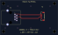

# Molex 어댑터 후속 배선 개선

배선 비교 기준: `acf822565702fcede400a967594e16c81a13b017`. 통합 기준은 M12와 공통 검사 규칙을 갱신한 `dd8b6fb0e8e581035004fc2e971fd26357f73b94`이며, 그 커밋에서 Molex 배선 자체는 바뀌지 않았다. 대상은 **`adapters/molex_slipring` 한 보드**다. 사용자가 정리한 신호 비아 0개 / F.Cu 배선 / TP 제거를 유지하면서, RJ45 탈출부의 좁은 배선과 P/N 길이 차이를 함께 줄였다.

**결과: 신호 전 구간 W 0.234 mm, 균일 결합 구간 edge gap 0.216 mm, A skew 0.792 mm / B skew 0.987 mm.** 기존 부품 위치·풋프린트·핀맵·4층 적층·실드 비아 8개를 유지했다. 커넥터 팬아웃은 폭이 같아도 간격이 벌어지므로 구간 전체를 100Ω으로 인증한 것은 아니다.

## 1. 길이 권고와 배선 구조 중 무엇을 우선했나

[TI Ethernet PHY 배치 지침](https://www.ti.com/lit/pdf/snla387)은 100M/10M MDI 배선의 길이 차이를 50 mil(1.27 mm) 이내로 권고하며, 비아/분기 최소화와 차동 임피던스 및 기준면 관리도 함께 요구한다. **1.27 mm는 이 수동 VNA 어댑터의 독립적인 합격선이 아니다.** 1.26과 1.28 mm 사이에서 성능이 갑자기 달라지는 경계로 사용하지 않는다.

이번 목적에서는 다음을 함께 관리했다.

1. 핀맵·제조 clearance·연속 기준면을 지킨다.
2. 균일 폭과 페어 간격을 확보하고, 좁거나 크게 벌어진 탈출 구간을 줄인다.
3. 불필요한 신호 비아/기준면 전환과 큰 길이 보정 우회로를 피한다.
4. 그 범위 안에서 P/N 길이 차이를 줄인다. 이번에는 **둘 다 1 mm 미만**을 얻었다.

이는 모든 주파수에서 성립하는 절대 우선순위가 아니다. 큰 길이 오차도 mode conversion을 만들 수 있고, 선폭/기준면이 달라지면 같은 물리 길이도 같은 전기적 지연이 되지 않는다. 기존 1.39/1.75 mm를 맞추려고 신호 비아나 큰 루프를 되돌리는 대신, RJ45 탈출 방향과 B 페어의 높이를 조정했다. 이번 수치는 native PCB 중심선 길이이며 커넥터 내부 핀·접점의 지연은 포함하지 않는다.

## 2. 전후 비교

| 항목 | 변경 전 | 변경 후 |
| --- | ---: | ---: |
| A P / N 길이 | 30.738 / 29.349 mm | 31.247 / 30.455 mm |
| A 길이 차이 | 1.388 mm | **0.792 mm** |
| B P / N 길이 | 31.798 / 30.046 mm | 30.410 / 29.424 mm |
| B 길이 차이 | 1.752 mm | **0.987 mm** |
| A P / N의 0.15 mm 구간 | 5.297 / 3.953 mm | **0 / 0 mm** |
| B P / N의 0.15 mm 구간 | 4.501 / 2.974 mm | **0 / 0 mm** |
| 긴 평행 결합 구간 A / B | 22.950 / 18.664 mm | **24.400 / 25.180 mm** |
| 신호 비아 / 신호층 | 0 / F.Cu | 0 / F.Cu |
| 실드 비아 / 기준면 | 8 / L2·L3 SHIELD | 8 / L2·L3 SHIELD |
| 두 페어의 긴 직선 구간 동박 간격 | 3.391 mm | **1.716 mm** |
| 서로 다른 페어의 배선끼리 최소 동박 간격¹ | 0.870 mm | **0.786 mm** |

¹ 마지막 행은 connector pad를 제외한 trace-to-trace 값이다. 부품 패드와의 제조 clearance는 native DRC로 따로 확인했다. 좁은 구간 길이와 P/N 길이는 패드 내부 중심선도 포함한다.

**절충도 있다.** A의 두 선은 기존보다 각각 약 0.51 / 1.11 mm 길어졌다. B는 양쪽 모두 짧아졌지만 A와 가까워졌다. 첫 후보는 B를 더 위로 옮겨 긴 구간의 페어 간격이 1.281 mm였고, 최종안에서는 길이 차이 1 mm 미만을 유지하면서 1.716 mm로 더 띄웠다. 이 비교는 배선 형상에 근거한 설계 판단이며 NEXT/FEXT 개선을 실측했다는 뜻은 아니다.

변경 전:



변경 후:


## 3. 실제 수정 내용

- A의 RJ45 접근부를 조금 위로 정리하고, P/N이 같은 0.234 mm 폭으로 합류하도록 했다. N의 짧은 수직 접근은 큰 serpentine 없이 길이 차이를 줄이는 데 사용했다.
- B의 긴 구간을 Y=19.000 / 19.450 mm로 옮겼다. RJ45 pin 3/6과 Molex pin 3/4 사이의 불필요한 상하 이동을 줄이고 두 선의 폭을 유지했다.
- Molex 보드의 `RJ45 pin escape` 폭 예외를 삭제했다. 이제 RJ45 안쪽도 일반 0.233–0.235 mm DRC 폭 규칙을 적용한다. M12 보드의 0.15 mm 탈출부 예외는 유지한다.
- `generate_adapters.py`, native PCB, `design.json`의 경로와 길이를 함께 갱신했다.
- `verify_adapters.py --board molex_slipring`으로 해당 보드만 검증할 수 있게 했다. 선택하지 않은 보드와 기존 검사 기록은 보존하며, 실행 버전은 `last_run`과 해당 보드 항목에 기록한다.

## 4. 검증 근거

- `dd8b6fb`의 새 공통 규칙(coupled gap 최소 0.21 mm, skew 최대 2.00 mm, uncoupled 길이 최대 16.60 mm, 신호 비아 0개)을 유지했다. 2.00 mm는 프로젝트 DRC 상한이며 TI의 1.27 mm 권고와 별개다. 이번 Molex의 실제 skew는 둘 다 1 mm 미만이다.
- KiCad 10.0.6: zone refill/save 후 **DRC 0, 미연결 0, schematic parity 0, ERC 0**.
- 기존 고정 pinmap / 독립 NC 검증 통과. [native 검사 보고서와 SHA-256](../../adapters/verification.json).
- 신규 생성 폴더의 Molex PCB와 저장된 PCB를 비교해 **net·층·폭·각 선분 양 끝 좌표가 일치**함을 확인했다.
- 변경 전후 부품 위치/회전, pad 크기·드릴·좌표·net이 일치한다. [전후 수치와 검사 결과](comparison.json).
- [geometry audit](../jlcpcb/geometry-audit.json)에서 최종 선폭과 긴 결합 구간의 gap을 다시 확인했다.

```bash
# 선택한 보드의 native 검사와 그림·hash 갱신
python adapters/verify_adapters.py --board molex_slipring --kicad-cli /path/to/kicad-cli

# KiCad pcbnew Python이 필요함; 읽기 전용 geometry 검사
python docs/jlcpcb/audit_geometry.py > /tmp/geometry-audit.json

# 기존 출력 폴더를 덮어쓰지 않는 재생성
python adapters/generate_adapters.py /path/to/new-output
```

공식 JLC 단면 계산의 0.234/0.216 mm 및 적층 조건은 그대로다. 이번 작업은 새 EM 해석이나 실물 RF 시험, 커넥터 기구 승인, 제조 release를 수행한 것이 아니다. 입고 뒤 OSL/UnknownThru 보정과 독립 검증 표준으로 최종 측정 재현성을 확인한다.
